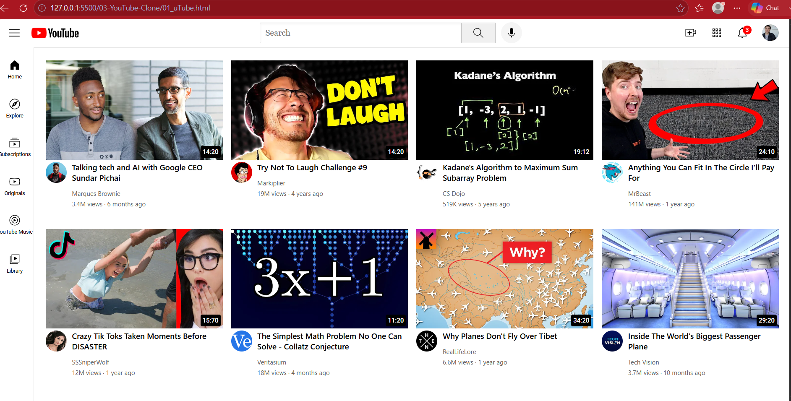

# 📺 YouTube Clone

A front-end clone of the YouTube homepage built using HTML and CSS. This project was created to practice modern layout techniques, responsive design, and UI structuring.

## 🚀 Features

- Responsive Header
- Sidebar Navigation
- Video Grid Layout
- Search Bar
- Video Cards
- Channel Information
- Hover Effects

## 🛠️ Technologies Used

- HTML5
- CSS3
- Flexbox
- CSS Grid

## 📚 What I Learned

- Building complex page layouts
- Combining Flexbox and Grid
- Responsive UI design
- CSS positioning
- Organizing large HTML & CSS projects

## 📸 Preview

## 📌 Status

✅ Completed