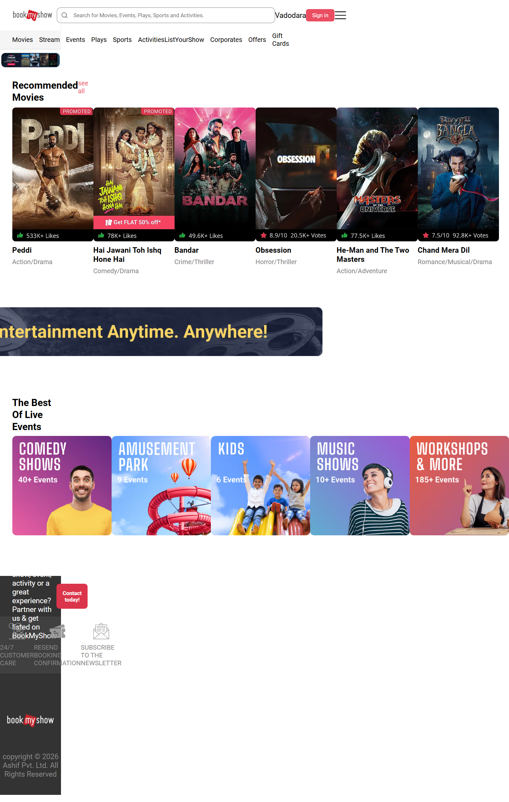

# 🎬 BookMyShow Clone

A front-end clone of the BookMyShow landing page built using HTML and CSS. The project focuses on creating a clean and responsive entertainment platform interface.

## 🚀 Features

- Navigation Bar
- Hero Banner
- Movie Cards
- Sections Layout
- Responsive Design
- Clean UI

## 🛠️ Technologies Used

- HTML5
- CSS3
- Flexbox
- CSS Grid

## 📚 What I Learned

- Designing modern landing pages
- Card-based layouts
- Responsive sections
- CSS positioning
- Better component organization

## 📸 Preview

## 📌 Status

✅ Completed